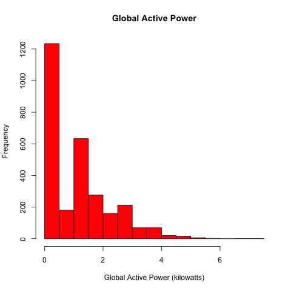
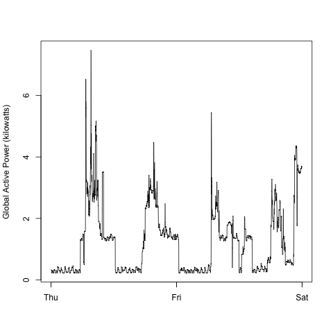
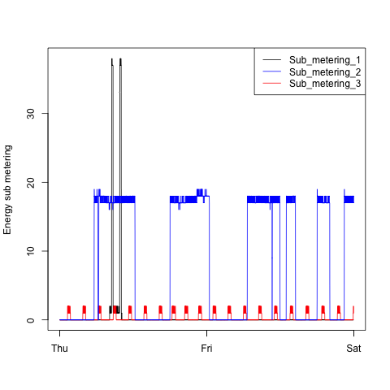
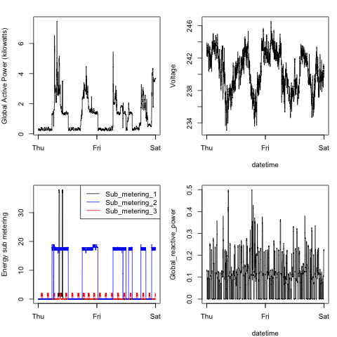

## Introduction

This assignment uses data from
the <a href="http://archive.ics.uci.edu/ml/">UC Irvine Machine
Learning Repository</a>, a popular repository for machine learning
datasets. In particular, we will be using the "Individual household
electric power consumption Data Set" which I have made available on
the course web site:


* <b>Dataset</b>: <a href="https://d396qusza40orc.cloudfront.net/exdata%2Fdata%2Fhousehold_power_consumption.zip">Electric power consumption</a> [20Mb]

* <b>Description</b>: Measurements of electric power consumption in
one household with a one-minute sampling rate over a period of almost 4 years. Different electrical quantities and some sub-metering values are available.


The following descriptions of the 9 variables in the dataset are taken from the <a href="https://archive.ics.uci.edu/ml/datasets/Individual+household+electric+power+consumption">UCI
web site</a>:

<ol>
<li><b>Date</b>: Date in format dd/mm/yyyy </li>
<li><b>Time</b>: time in format hh:mm:ss </li>
<li><b>Global_active_power</b>: household global minute-averaged active power (in kilowatt) </li>
<li><b>Global_reactive_power</b>: household global minute-averaged reactive power (in kilowatt) </li>
<li><b>Voltage</b>: minute-averaged voltage (in volt) </li>
<li><b>Global_intensity</b>: household global minute-averaged current intensity (in ampere) </li>
<li><b>Sub_metering_1</b>: energy sub-metering No. 1 (in watt-hour of active energy). It corresponds to the kitchen, containing mainly a dishwasher, an oven and a microwave (hot plates are not electric but gas powered). </li>
<li><b>Sub_metering_2</b>: energy sub-metering No. 2 (in watt-hour of active energy). It corresponds to the laundry room, containing a washing-machine, a tumble-drier, a refrigerator and a light. </li>
<li><b>Sub_metering_3</b>: energy sub-metering No. 3 (in watt-hour of active energy). It corresponds to an electric water-heater and an air-conditioner.</li>
</ol>

## Loading the data

To load the data, just run:
```R 
   source('./getDataSet.R')
   dataset <- getDataSet()
```

When we loading the dataset into R, I do the following:

* The dataset has 2,075,259 rows and 9 columns. 

* I subset the data from the dates 2007-02-01 and
2007-02-02. 

* I convert the columns:
1. Date to Date Class
2. Time to Time Class 
3. The rest columns to numeric

* I create a new column datetime from: Date + Time

* We dont care about the missing values.


## Making Plots

To make the plots just run:

```R 
   source('./plot1.R')
   plot1()
   source('./plot2.R')
   plot2()
   source('./plot3.R')
   plot3()
   source('./plot4.R')
   plot4()
```

its not necessary run getDataSet()


## The four plots that I  construct are shown below. 

### Plot 1

 


### Plot 2

 


### Plot 3

 


### Plot 4

 

